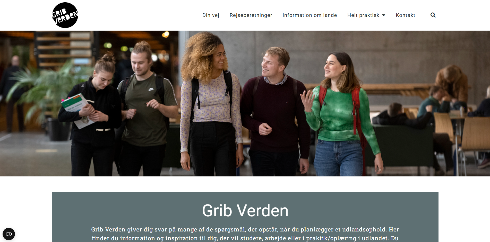

# My Web Projects Portfolio

## Table of Contents

- [GribVerden website](#gribverden-website)
- [DeskCamera Project](#deskcamera-project)

---
## GribVerden website

**Duration**: Nov, 2021 – Jan, 2022

**Website**: <a href="https://gribverden.dk/" target="_blank">https://gribverden.dk/</a>

**Description**:

Website for the Danish Ministry of Education and Research. This client wanted to make a site with easy access to information, strict design, fast, and easy to edit.
I created this site from scratch using WordPress. I used Elementor to create the pages. In addition, I made my own plugin for more convenient navigation through the site content.

**Key Skills**: HTML5, WordPress, WordPress Plugin, Elementor, PHP

---
## DeskCamera Project

**Duration**: Apr, 2019 – Now

**Website**: <a href="https://www.deskcamera.com/" target="_blank">https://www.deskcamera.com/</a>

**Description**:

My client approached me with the goal of developing a modern and functional website for a software company. Starting from a provided mock-up, I built the entire site from scratch using the Divi theme as a foundation. The project involved implementing a range of customized features tailored to the client’s needs. The website supports multiple languages to cater to an international audience and includes a dynamic news feed to keep users updated with the latest company announcements. I also created several custom shortcodes to simplify content management and enhance the site's flexibility. Additionally, I extended the default WooCommerce functionality to support specific business logic and improve the overall user experience.

**Key Skills**: PHP, WooCommerce, HTML5, WordPress, WordPress Plugin

---
